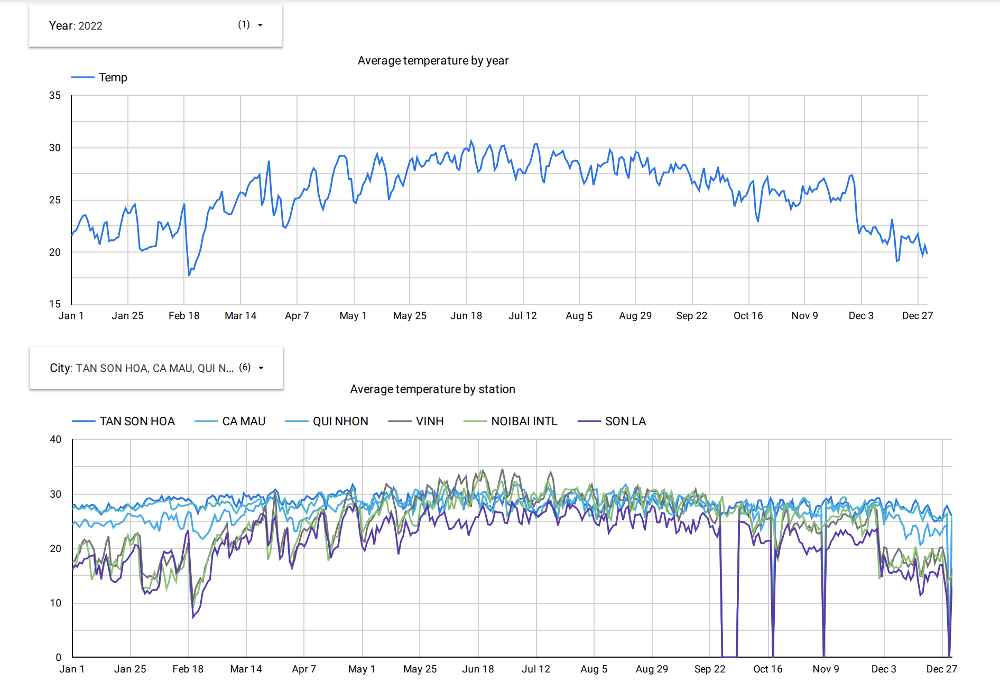
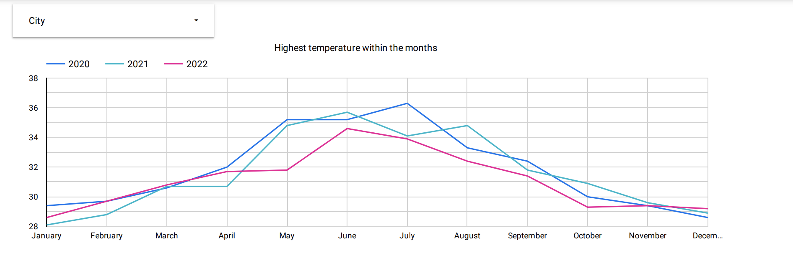
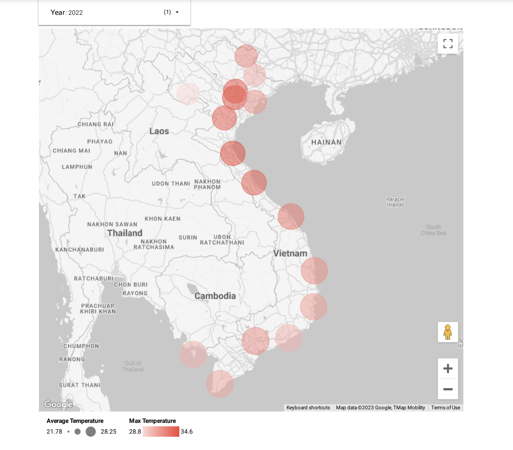

# VietNam-temperature-datasets

This project aims for three things:

1. Building a data pipeline to retrieve climate data from source ([NOAA](https://registry.opendata.aws/noaa-ghcn/)), process and store in data lake/ data warehouse.
2. Using big data processing frameworks like Spark, Dbt, BigQuery to process, transform and clean data from (1) for reports and analytics.
3. Using data visulization tool (Looker studio) to visualize Viet Nam temperature data in the recent years.

## Technology stack

- Terraform: an infrastructure-as-code software tool for provisioning and managing cloud resources.
- Docker: building image for deployment.
- Prefect: data orchestration tool for automate the data pipeline.
- Spark: read, process data and write to storage places.
- Dbt: transform data from BigQuery.
- Google Cloud Storage (GCS): data lake.
- BigQuery: data warehouse.
- Dataproc: spark cluster.
- Looker studio: data visulization.

## Setup
1. Install Apache Spark
2. Install Python 3
3. Install [requirements.txt](.github/requirements.txt)
```console
pip install -r requirements.txt
```
4. Install Terraform
5. Register Google Cloud Platform (GCP) account, create a service account with BigQuery, Dataproc, Storage admin roles
5. Create prefect cloud account

## Run

### Create google cloud resources
```console
cd terraform
terraform init
# changes will be deploy
terraform plan
# deploy changes
terraform apply
```

### Run flows with prefect
Create deployments:

For get station data from noaa-datasets and store in google cloud bucket:
- Running in local
```console
 prefect deployment build workflow/flows/reports.py:stations_to_gcv -n <name_your_flow>
 prefect deployment apply <file_from_build>
```
- Running with docker
```console
 prefect deployment build workflow/flows/reports.py:stations_to_gcv -n <name_your_flow> -i docker-container
 prefect deployment apply <file_from_build>
```
- Add enviroment variables in .yml file, or specify docker image (build from [Dockerfile](.github/Dockerfile)) if you run in docker

Run flows:
- Start prefect agent
```console
prefect agent start -q 'default' 
```

- Start flow (you can overwrite paramenter with -p flag (ex. -p 'years=[2023]')):
```console
prefect deployment run <flow_name>
```

### Run dbt
Update data sources in [schema.yml](.github/dbt/models/temperature/schema.yml)
```console
cd dbt
dbt run 
```

## Looker studio
Create a new project and choose source data from BigQuery.

Here is some analysis about Viet Nam temperature data that i have made in the recent years:



